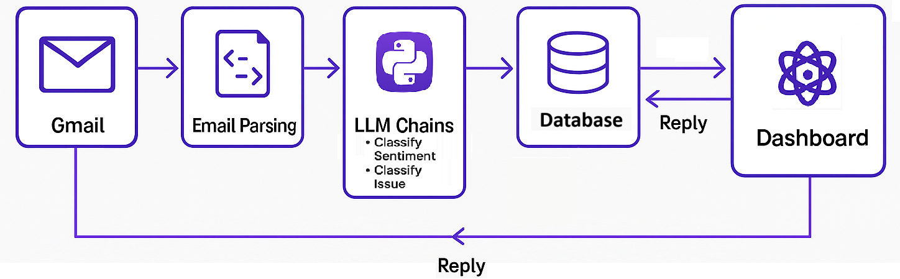

# GenAI-Driven Intelligent Email Ticketing
This repository contains the source code for an intelligent email processing system that automates complaint classification and triage. Designed for service-oriented industries such as logistics and customer support, the system leverages Natural Language Processing (NLP) techniques and a lightweight architecture to enhance operational efficiency.

## Live Demo
[](https://www.youtube.com/watch?v=66db5RdDg58)

Click the image above to watch the full demonstration on YouTube.

---

## Key Features

- Automated Email Parsing: Extract sender, subject, body, and timestamp.
- Sentiment Analysis: Identify negative emails using rule-based detection.
- Complaint Classification: Map issues to a predefined issue dictionary.
- Team Assignment: Route tickets to the correct operational team.
- Streamlit Dashboard: View tickets by team, date, and sentiment.
- Lightweight Backend: Local SQLite database for quick and easy deployment.

---

## System Architecture


---

## Repository Structure
```
📦 GenAI-Driven-Intelligent-Email-Ticketing
├── app.py              # Streamlit dashboard for ticket view & team analytics
├── db.py               # SQLite backend for storing ticket metadata
├── email_processor.py  # Core logic: parsing, sentiment, and classification
├── sample_data/        # Sample dataset with 500 emails
├── demo_video.mp4      # Video demonstration of the system (20 MB)
├── requirements.txt    # Python dependencies
└── README.md           # This documentation file
```

---

## Setup Instructions

### Clone the Repository
```bash
git clone https://github.com/Naresh23032003/GenAI-Driven-Intelligent-Email-Ticketing.git
cd Naresh23032003/GenAI-Driven-Intelligent-Email-Ticketing
```

### Install Dependencies
```bash
pip install -r requirements.txt
```

### Run the App
```bash
streamlit run app.py
```

The dashboard will open in your default browser at `http://localhost:8501`.

---

## How It Works

1. **Input**: Incoming emails are parsed to extract content and metadata.
2. **Processing**: Sentiment is detected and categorized using keyword rules.
3. **Classification**: Negative sentiment emails are mapped to pre-defined issue labels.
4. **Routing**: Each issue is linked to a responsible team (e.g., Logistics, Payment, Support).
5. **Display**: A real-time dashboard displays complaints, statuses, and analytics.

---

## Sample Data
The `sample_data/` folder contains a dataset of 500 sample emails used to demonstrate system functionality. Use this data to test the system or as a reference format for integrating additional datasets.

---

## License
This project is licensed under the MIT License.

---

## Acknowledgements
Built as part of a research project for ICACECS 2025, this system integrates simple yet effective tools to deliver measurable improvements in service efficiency.

---

## Authors
- Primary Developers & Researchers: Naresh R, Sreeja Sunkeswaram

For questions or collaboration requests, please open an issue or contact us.
